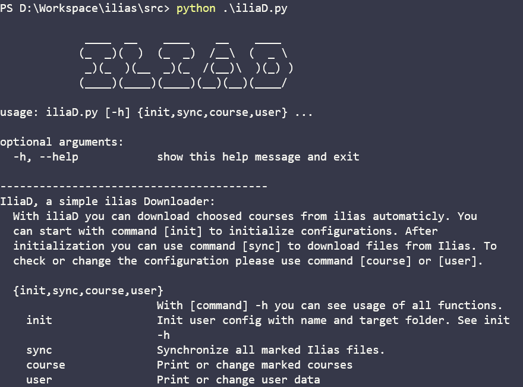

# ILIAD

A simple and easy ilias downloader written with python. It helps you to download files on ilias to your computer.

<div align=""></div>
</br>

> **<font color="red">Important:</font>** The project is now only support Ilias platform of ***Karlsruhe Institut für Technologie***.


## Install 

You can download the built file or download the source code.


</br>

<font size='4'>**&diams; <u>Requirement if using source code**</font></u>

```python
altgraph==0.17
beautifulsoup4==4.9.0
bs4==0.0.1
certifi==2020.4.5.1
chardet==3.0.4
future==0.18.2
idna==2.9
pefile==2019.4.18
PyInstaller==3.6
pywin32-ctypes==0.2.0
requests==2.23.0
soupsieve==2.0
texttable==1.6.2
urllib3==1.25.9
```
## Usage

</br>

<font size='4'>**&diams; <u>Initiate**</font></u>

``iliaD init`` 

or

``iliaD init -name uxxxx -target path/of/target``

For the first time to use you should use command ``init`` to initiate the user information. Follow the constructions you can set your user name in form "**uxxxx**", the **password** and the path of **target directory**.

``iliaD course``


After user data initiated, you can use command ``course`` to choose courses to be downloaded. Or you can use command ``sync`` to choose courses and download the directly.

</br>

<font size='4'>**&diams; <u>Synchronize**</font></u>

``iliaD sync``

Use command ``sync`` you can synchronize new files. The exist file will not be changed. Only new file in ilias will be downloaded to the folder.

</br>

<font size='4'>**&diams; <u>Check user data and edit**</font></u>

``iliaD user``

or

``iliaD course``

Use command ``user`` to check and edit the user name, target directory and password. Use command ``course`` to check and edit marked courses.


## Commands

|Command | Usage |
|:-:|:-:|
| ``init`` |Init user config with name and target folder |
|``sync`` |Synchronize all marked Ilias files |
|``user`` | Print or change user data|
|``course`` |Print or change marked courses |


## Automatic daliy synchronize

If you have a raspberry pi or any Unix computer, you can do the following instructions to synchronize the ilias folder with your cloud storage.

1. Download the [iliaD](https://github.com/cold-soda-jay/iliaD) .
2. Download [rclone](https://rclone.org/) .
3. Bind rclone with your cloud storage.
4. Initiate the iliaD, set the target directory (e.g. ``/home/pi/Onedrive/SS20/``)
5. Open crontab: with ``crontab -e`` in terminal
6. Add following instructions:
    1. ``00 05 * * * /path/of/iliaD sync >> /path/of/iliaD.log 2>&1``
    2. ``30 05 * * * rclone -v copy path/of/target/directory/ path_of_cloud >> path/of/rclone.log 2>&1``

With the seetings, your raspberry pi will synchronize the ilias folder, download new files at 5:00 am. and upload them in your cloud storage at 5:30 am.

